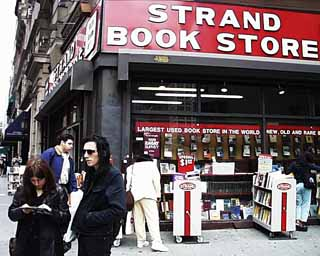

# NI-NMU

## Introduction
This repository serves as a full list of the locations used in my project for the NI-NMU course at FIT CTU and their context to the course.

Play the geoguessr map on this link:
https://www.geoguessr.com/maps/67865f7136272f8bdf334385

## Locations
### La Ciotat, Provence-Alpes-Côte d'Azur
Lumière brothers - L'Arrivée d'un train en gare de La Ciotat (1896)

The La Ciotat railway station at which the Lumière brothers filmed their [iconic motion picture](https://www.imdb.com/title/tt0000012/?ref_=nv_sr_srsg_0_tt_8_nm_0_in_0_q_la%2520ciotat).

### Ungava Peninsula
Robert J. Flaherty - Nanook of the North (1922)

The general location of [the 1922 documentary](https://www.imdb.com/title/tt0013427/?ref_=nv_sr_srsg_0_tt_5_nm_3_in_0_q_nanook) following an Inuk man.

### 2 C. Miguel Mañara, Seville, Andalusia
Michael Bielicky - Columbus 2.0 (2008)

A wall close to Seville cathedral that the [Columbus 2.0](https://www.bielicky.net/projects/columbus-20-sevilla-2008) project of Michael Bielicky was projected onto.

### 45 W 7th St, Locust Valley, New York
Ray Johnson - Mail Art

The return address on one of Ray Johnson's Mail Art pieces.

### 60 E 12th St, New York
Markéta Baňková - NYC Map (1999-2001)

[One of the locations](https://www.nycmap.com/broadway10.html) in the NYC Map project of Markéta Baňková, showing the Strand Book Store.

### 401 Main St, Los Angeles, California
Amalia Ulman - Excellences & Perfections (2014)

The location of one of Amalia Ulman's Instagram posts during the Excellences & Perfections performance.

### 58 Lungomare IX Maggio, Bari, Apulia
Jon Rafman - The Nine Eyes of Google Street View (2008)

One of the many screenshots from Google Streetview captured by Jon Rafman in his work [The Nine Eyes of Google Street View](https://anthology.rhizome.org/9-eyes).

### 140 3rd St, San Francisco, California
Aram Bartholl - Map (2019)

An [installation](https://arambartholl.com/map/) by Aram Bartholl, where the pin resembling the online clipart from Google Maps is placed at an actual point of interest in the real world.

### 60128 Strait Of Juan de Fuca Hwy
Clement Valla - Postcards from Google Earth (2019)

One of [many badly rendered satellite images](https://www.postcards-from-google-earth.com/PfGE/bc) on Google Earth.

### 15 Cheshire St, London, England
Paolo Cirio - Street Ghosts (2012)

One of the places where Paolo Cirio posted a picture of a person captured by Google Streetview at the actual location. [Street Ghosts](https://paolocirio.net/work/street-ghosts/)

